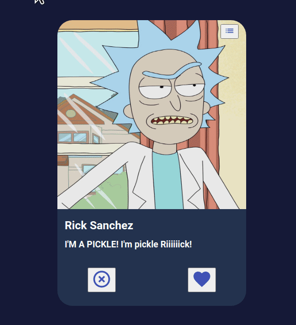

  

  # Camily_Match
  
Projeto com proposta de imitar as funcionalidades básicas do Tinder utilizando a API criada pela Labenu
 

 
 
  

<h3 Align="center"> 
	🚧 🚀 Finalizado...  🚧
</h3>

 
 

### Features

- [x] Dar Match
- [x] Vizualizar Match
- [x] Excluir matches recebidos

 
 

## 🛠 Tecnologias

As seguintes ferramentas foram usadas na construção do projeto:

- [React](https://pt-br.reactjs.org/)
- [Javascript](https://developer.mozilla.org/pt-BR/docs/Web/JavaScript)
- [CSS](https://developer.mozilla.org/pt-BR/docs/Web/CSS)
- [API REST](https://documenter.getpostman.com/view/7549981/SW12yx56?version=latest)

 
 

### Autor
---

<a href="https://www.linkedin.com/in/camily-abade-4a663919a/">
 
  
 <b>Camily Abade</b></a> <a>🚀</a>

Feito com ❤️ por Camily Abade 👋🏽 Entre em contato!

 
